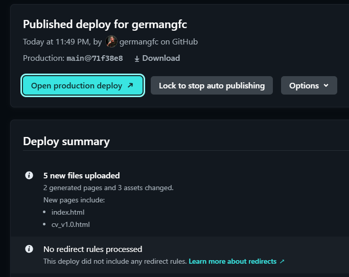
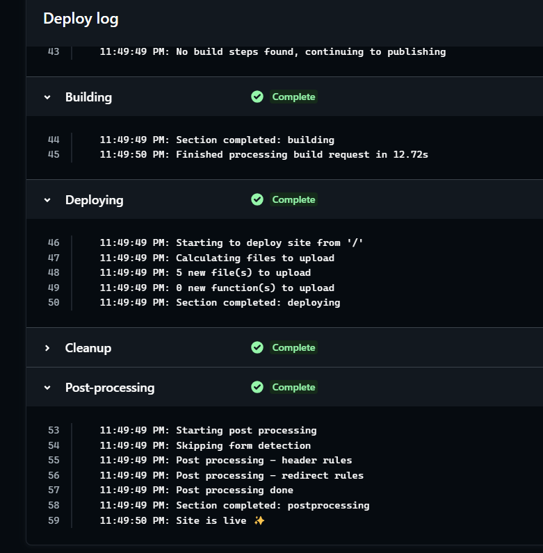

# Practica-Netlify
## Objetivo
El objetivo es comprobar el despliegue continuo automático en Netlify de una web personal que enlaza a un curriculum usando HTML y CSS y Bootstrap. 
Se mostrarán capturas de dicho despliegue continuo en Netlify cada vez que se haga un cambio en la rama main del proyecto.

## Proceso y capturas
La idea es crear un repositorio con nuestro proyecto en GitHub, donde se alojará nuestro proyecto base y que importaremos posteriormente desde Netlify.
Iremos haciendo cambios en el repositorio para comprobar que Netlify hace el despliegue continuo.

Previamente, nos habremos registrado y logueado en Netlify, en mi caso, con mi usuario de GitHub.
### 1. Repositorio GitHub
Creamos el repositorio vacío en GitHub.  

### 2. Importar desde Netlify
Importamos el repositorio:  

  

\
Elegimos el origen (GitHub):

\
Autorizamos a Netlify verificando nuestra identidad de GitHub:

\
Instalamos, modificando la opción por defecto (All repositories) para
que se apliquen varios permisos solo para este repositorio:

  
  

\
Confirmamos el acceso a GitHub:

\
Una vez confirmada nuestra identeidad, nos devuelve a la pantalla anterior en Netlify y procede con el despliegue:

\
Debemos configurar varios apartados del despliegue. En este caso únicamente
el nombre del sitio (por el que luego podremos acceder a nuestra página en Netlify) y la rama que se desplegará.

En mi caso la página de Netlify es: https://germangfc.netlify.app y la rama elegida la ***main***.

### 3. despliegue inicial

Hacemos clic en **Deploy** para proceder con el despliegue:

\
Hacemos clic en **View site deploy** para acceder al resultado del despliegue.
En nuestro caso, observamos que solo se ha subido un archivo, que es el README.md
de nuestro repositorio, inicialmente no tiene mas:

### 4. Modificación del repositorio

Realizamos cambios en nuestro repositorio. En este caso, subimos la página inicial.

Con esto provocaremos un cambio en la rama main, que activará el despliegue automático en Netlify

\
Justo tras subir los cambios al repositorio: 

\
En Netlify aparece el inicio del despliegue: 

\
Y entrando en el despliegue podemos ver el log:

\
Y una vez finalizado, el resultado (un archivo añadido):

### 5. Modificaciones posteriores

Añadimos nuevos archivos y modificaciones a nuestro repositorio: modificamos la página inicial 
y subimos sus imágenes, estilos, la página con el CV y un *.gitignore*:

